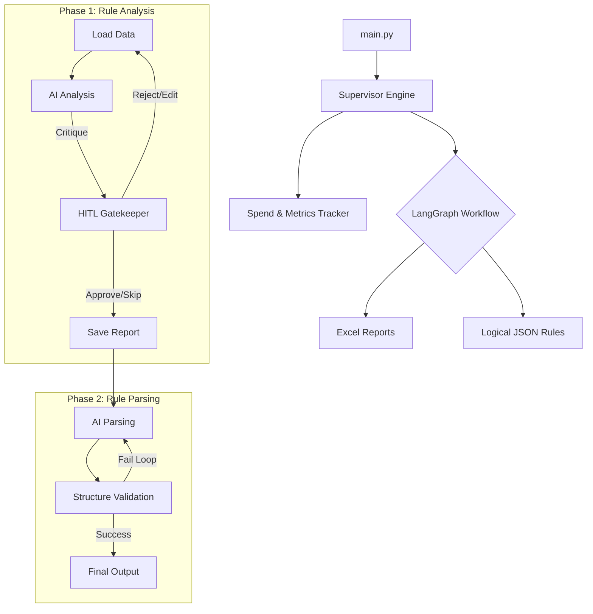

# 🦅 Congress Prioritization System

A powerful, agentic workflow for automating the translation of complex prioritization rules into structured data. This system utilizes an iterative, AI-driven approach with Human-in-the-Loop (HITL) checkpoints to ensure rules are logically sound and correctly structured.

---

## 🚀 Overview

The **Congress Prioritization System** streamlines the process of analyzing and parsing prioritization rules for large datasets. It uses a modular "Chained State" architecture to transform raw human-written rules into machine-readable JSON structures while maintaining high accuracy through AI critique and human validation.

### ✨ Key Features

- **Agentic Analysis**: AI critiques your rules before they are applied, identifying ambiguities or logic gaps.
- **Human-in-the-Loop (HITL)**: A dedicated gatekeeper node ensures a human always reviews AI suggestions.
- **Structural Parsing**: Textual rules are converted into complex nested JSON logic (Includes/Excludes).
- **Multi-LLM Support**: Built on LiteLLM, allowing seamless switching between models like Gemini, GPT, or Claude.
- **Automated Validation**: Integrated structural validation with a 3-iteration self-correction loop.
- **Robust Exception Handling**: Chain-aware nodes that can fall back to disk-reads if state is inconsistent.

---

## 🏗️ Technical Architecture

The architecture is built using **LangGraph** for state orchestration and **LiteLLM** for model-agnostic communication.



---

## 🧬 Core Workflow Stages: In-Depth Breakdown

The system operates in two high-level phases, orchestrated as a stateful graph.

### PHASE 1: Rule Analysis (Iterative Optimization)

This phase is designed to "clean" the human input before it is serialized into data.

#### 1.1 Data Loading (`analysis_load_data`)

- **Action**: Ingests three primary CSV files: `rules.csv` (mandatory), `client_keywords.csv` (mandatory), and `custom_synonyms.csv` (optional).
- **Logic**: Validates the existence of mandatory files. Reads data using Pandas to ensure encoding compatibility (UTF-8) and stores the raw string content in the `PrioritizationState`.

#### 1.2 AI Analysis Node (`analysis_analyze`)

- **Action**: Invokes the LLM to perform a "Critique" of the rules.
- **Logic**: The AI compares the `rules_raw` against `client_keywords`. It generates a structured report identifying:
  - **Issues**: Ambiguities, missing keywords, or logical overlaps.
  - **Optimizations**: Suggested phrasing changes to make rules more deterministic.
- **Output**: Populates `state["analysis_report"]`.

#### 1.3 Human Gatekeeper (`analysis_human_review`)

- **Action**: **CRITICAL INTERRUPT.** The process pauses and transfers control to the terminal/UI.
- **Logic**: Uses LangGraph's `interrupt()` mechanism. It presents the AI's critique to the user and waits for a command (`Approve`, `Edit`, `Reject`, `Skip`, `Quit`). This ensures human oversight of all AI-suggested changes.

#### 1.4 Applying Optimizations (`analysis_apply_optimizations`)

- **Action**: Merges AI suggestions if approved.
- **Logic**: Executes string replacements on `rules_raw` based on the AI's `optimized_text` suggestions. The result is stored in `state["transformed_rules"]`.

#### 1.5 Report Persistence (`analysis_save_report`)

- **Action**: Archives the session for auditing.
- **Logic**: Generates an Excel notebook (`Rule Analysis Output.xlsx`) containing two sheets: one for identified issues and one for the applied optimizations.

---

### PHASE 2: Rule Parsing (Structural Transformation)

This phase converts the refined rules into a machine-readable JSON object.

#### 2.1 Idempotent Load (`parsing_load_data`)

- **Action**: Ensures data continuity.
- **Logic**: If the previous phase was skipped, this node re-loads data from disk. If Phase 1 was completed, it pulls the `transformed_rules` directly from memory to prevent unnecessary I/O.

#### 2.2 Structural Parsing (`parsing_parse`)

- **Action**: The "Heavy Lifting" node.
- **Logic**: Translates natural language rules into a nested JSON structure. It differentiates between `keyword_filtering` (deterministic matching), `context_filtering` (semantic inference), and `hybrid` logic.

#### 2.3 Structural Validation (`parsing_validate`)

- **Action**: Automated quality control.
- **Logic**: Validates the output JSON against a strict schema. It checks for:
  - Syntactic correctness (valid JSON).
  - Mandatory presence of `relevance` and `priorities` keys.
  - Contextual accuracy (e.g., ensuring priority levels are correctly assigned).

#### 2.4 Self-Correction Loop

- **Action**: Automated retry mechanism.
- **Logic**: If `parsing_validate` discovers errors, the system loops back to `parsing_parse`. The new prompt includes the specific technical error messages, allowing the LLM to "fix" its own output. This loop runs for up to 3 iterations.

#### 2.5 Final Persistence (`parsing_save_output`)

- **Action**: Generates the final project artifact.
- **Logic**: Saves the validated JSON to the `outputs/` folder with a standardized filename: `parsed_rules_{timestamp}_{model}.json`.

---

## 🚦 Human-in-the-Loop (HITL) Decisions

During the gatekeeper node, the operator determines the agent's path:

| Command         |        Action        | Impact                                                 |
| :-------------- | :------------------: | :----------------------------------------------------- |
| **[a] Approve** | Apply AI suggestions | Suggested optimizations are merged into the rules.     |
| **[e] Edit**    |   Manual CSV Edit    | System re-loads and re-analyzes a specific CSV file.   |
| **[r] Reject**  |   Provide Feedback   | AI re-analyzes the rules based on the user's critique. |
| **[s] Skip**    |  Use Original Rules  | Forwards rules as-is to the Parsing phase.             |
| **[q] Quit**    |  Terminate Session   | Saves the analysis report and exits.                   |

---

## 💾 State Management: `PrioritizationState`

The system maintains a unified state object throughout the entire session.

| Field               | Type             | Description                                       |
| :------------------ | :--------------- | :------------------------------------------------ |
| `directory`         | `str`            | Working directory for inputs/outputs.             |
| `model`             | `str`            | LLM model identifier (e.g., `gemini-2.5-pro`).    |
| `rules_raw`         | `Optional[str]`  | The current raw text of the rules.                |
| `analysis_report`   | `Dict`           | Stores AI-suggested issues and optimizations.     |
| `review_history`    | `List`           | History of human decisions and feedback.          |
| `parsed_rules`      | `Optional[Dict]` | The resulting structured JSON output.             |
| `validation_errors` | `List`           | Programmatic errors found during JSON validation. |

---

## 🛠️ Edge Cases & Robustness

- **State Inconsistency**: If the Parsing phase starts without data in the state, nodes fall back to direct disk reads.
- **Interrupt Safety**: The gatekeeper allows LangGraph `Interrupt` exceptions to propagate correctly, preventing "pause" from being treated as "failure."
- **Mutual Exclusivity**: The Analysis phase attempts to detect overlaps (e.g., an abstract matching both High and Medium rules).
- **Validation Retries**: Prevents "hangs" by capping self-correction attempts at 3 before logging a phase failure.

---

## 📊 Monitoring & Execution

### How to Run

```bash
python main.py
```

### Logging

Logs are captured with professional formatting in `logs/YYYY-MM-DD/`:

- **Workflow Session Metrics**: Tracking net cost (Token Spend) and cumulative environment spend.
- **Console Progress Indicators**: Visual cues (🚀, ✅, ⚠️, 🛑, 📊) for real-time monitoring.
