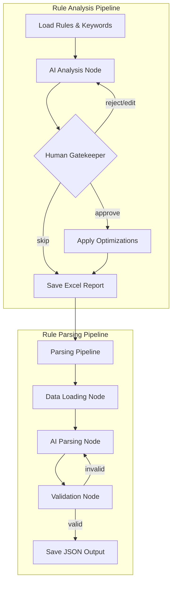

# Congress Prioritization Workflow Documentation

This document provides a production-grade overview of the Congress Prioritization system, detailing the technical architecture, data flow, human-in-the-loop (HITL) checkpoints, and known edge cases.

## System Architecture

The system is built on a modular "Chained State" architecture using **LangGraph**. It consists of two primary pipelines that share a unified state object (`PrioritizationState`) to ensure continuity without redundant data loading.



---

## 1. Rule Analysis Pipeline

This stage focuses on identifying logical conflicts and suggesting language optimizations for the raw prioritization rules.

### Steps:

- **Load Data**: Synchronizes `rules.csv` and `client_keywords.csv`.
- **AI Analysis**: Evaluates rules for ambiguity, overlap, and redundancy.
- **Human Gatekeeper**: Pauses execution via `interrupt()` for user review.

### Human-in-the-Loop Decisions:

| Action      | Impact                                                                              |
| :---------- | :---------------------------------------------------------------------------------- |
| **Approve** | AI suggested optimizations are applied as string replacements to `rules_raw`.       |
| **Skip**    | Original rules are forwarded to the next pipeline, ignoring suggestions.            |
| **Reject**  | User provides feedback; the AI re-analyzes based on the critique.                   |
| **Edit**    | User provides a path to a manually edited CSV; the system re-loads and re-analyzes. |

---

## 2. Rule Parsing Pipeline

This stage converts the refined human-readable rules into a structured JSON format used by downstream ranking agents.

### Steps:

- **Idempotent Loading**: Checks if `rules_raw` exists in the state (from the previous step). If missing, it loads from disk as a fallback.
- **AI Parsing**: Extracts structured logic, priorities, and relevance criteria.
- **Validation**: Programmatic check to ensure the output contains mandatory keys (`relevance`, `priorities`). It allows up to 3 retries on failure.

---

## Edge Cases & Fail-Safe Mechanisms

### 1. State Inconsistency

**Scenario**: The Analysis pipeline fails or is skipped by the user.
**Fix**: The Parsing pipeline's `load_data` node is designed to be "chain-aware". If it doesn't see data in the state, it automatically falls back to disk reads, preventing a crash.

### 2. Broad Exception Catching

**Scenario**: LangGraph `interrupt()` raises a specific exception to pause the graph.
**Fix**: The `human_gatekeeper` node explicitly allows name-matched "Interrupt" exceptions to propagate, ensuring the system doesn't treat a "pause" as a "failure".

### 3. Mutual Exclusivity Conflicts

**Scenario**: Abstracts matching multiple High, Medium, and Low rules simultaneously.
**Pain Point**: AI analysis might miss subtle logical overlaps.
**Recommendation**: Use the "Iteration Count" tracked in the state to monitor how many times a rule set has been rejected. Frequent rejections indicate "Prompt Drift" or overly complex base rules.

---

## Known Pain Points

- **CSV Character Escaping**: String-based optimization application (`applied_count`) can be fragile if the AI suggests changes containing special CSV characters (commas, quotes) that weren't present in the original.
- **Validation Retries**: If the LLM consistently generates invalid JSON, the system can hang for up to 3 long-running API calls before failing.
- **State Bloat**: As the `review_history` grows across iterations, the state object sent to the LLM increases in size, potentially leading to context window issues for extremely long rule sets.

---

## How to Run

```bash
# Entry point for the entire two-stage flow
python main.py
```

Check `logs/` for granular timestamps of each node execution and `analysis_reports/` for the final human-readable audit trail.
